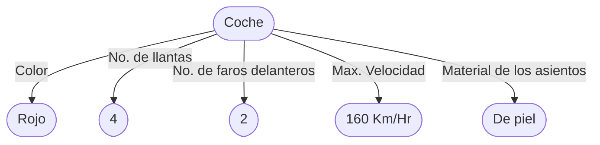
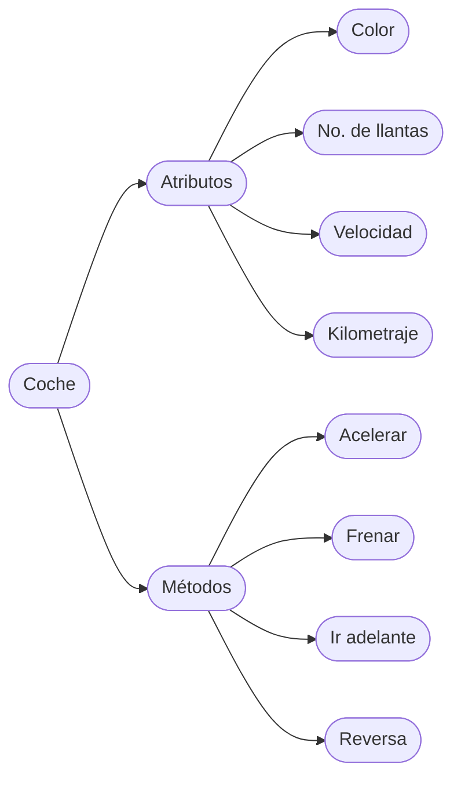
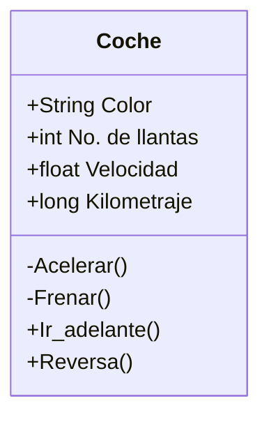
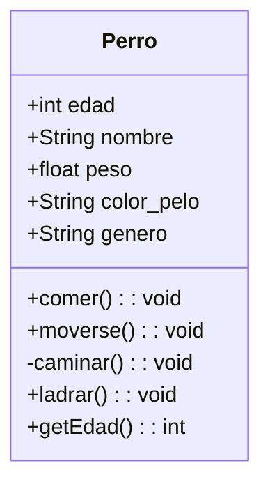

# Clases y Objetos
---
---

Las clases y los objetos son el eje central del paradigma orientado a objetos, debemos entender lo que son y sus diferencias para no utilizar estos conceptos de manera indistinta.

<br>
<br>

## Objeto
---

Lo primero es hablar acerca de objetos, un objeto es una entidad que puede ser tangible o no, cada objeto tiene un conjunto de características y funciones, con ello sabemos que los objetos tendrán estados y comportamientos.

* _Estado_: Son los datos asociados con el objeto que nos indican la situación en la que se encuentra, como por ejemplo un objeto puede tener una velocidad, capacidad de carga, volumen, calificación, color, encontrarse encendido/apagado, etc.
* _Comportamiento_: Es la manera en la que el objeto responde a estímulos, como por ejemplo lo que sucede cuando un botón es presionado, cuando la gasolina de un automóvil se ha terminado o lo que sucede cuando se hace un retiro de una cuenta bancaria.

En este punto nos acercamos al concepto de clases por lo que ahora debemos comprender que las características de un objeto las llamaremos ahora ___atributos___ y sus funciones o comportamientos pasaremos a conocerlos como ___métodos___.

Para entender estos conceptos vamos a utilizar un ejemplo que intente dejar claro lo que son. Partiremos desde el hecho de que un coche es un objeto y si deseamos abstraerlo para poder hacer una representación informática de el, debemos observar las características y funcionalidades que tiene o puede tener un coche. Para empezar con este ejemplo observemos el siguiente coche:

![[coche_rojo.jpg | center | 350]]

Algunas de las características del coche anterior son las siguientes:



Comencemos mencionando que las característica del color es completamente observable, sin embargo el no. de llantas es algo intuitivo ya que no observamos en su totalidad las 4 y en un hipotético caso tal vez nos encontremos un auto con más llantas. Algo más por resaltar son las características de máxima velocidad y el material de los asientos, si bien no son características que observemos en la imagen o exista algún indicio, supondremos que estas son las características de este coche en particular.

![[coches.jpg | center | 300]]

Ahora si observamos la imagen anterior vemos un tipo de coche distinto, y cada uno de diferente color, tal vez sus interiores sean distintos al coche rojo que vimos anteriormente, sin embargo todos cumplen la condición de que son coches, automóviles. En este punto debemos comenzar a hablar de lo que es una clase.

<br>
<br>

## Clase
---

Con el concepto de objeto logramos observar que cada objeto tiene características particulares, sin embargo como objetos podemos encontrar características comunes. Si bien en el ejemplo de objetos se limito a mencionar características el mismo concepto se extiende a sus funcionalidades, retomando el ejemplo de un coche podemos mencionar que una función de un coche puede ser el acelerar o el bajar las ventanas, sin embargo podemos observar que distintos objetos coche tienen la misma funcionalidad.

Entonces ¿qué pasa cuando tenemos características y funcionalidades que distintos objetos tienen en común? en este punto toma relevancia el concepto de clase.

Una clase es la abstracción que podemos formar alrededor de uno o más objetos, esta abstracción podemos concebirla como una plantilla. Ahora bien, en programación podemos decir que una clase es un tipo de dato definido por el programador específicamente para crear objetos. Intentemos ahora unir las dos definiciones anteriores para poder conceptualizar claramente lo que es una clase.

Sigamos con el ejemplo del coche, ya vimos que teníamos distintos objetos que eran todos coches pero cada uno podía tener sus particularidades, intentemos generalizar lo que es un coche para poder crear la clase coche.



Como podemos ver, la clase a diferencia del objeto no me dice cuales son las particularidades de un objeto, no me dice el color del coche, si no que me dice que características (atributos) y funcionalidades (métodos) son las que definen lo que es un objeto, para este ejemplo lo que es un coche.

Es importante aclarar que la clase coche puede ser definida de muchas maneras, el ejemplo solo muestra una de ellas, la definición de la clase coche puede variar según el uso que le va a dar a la clase, lo que se necesite tener en cuenta en el proyecto o programa en el que utilizaremos el coche, por lo mismo podemos entender que la clase coche podrá tener más o menos atributos y métodos.

Por último, la manera más común de representar una clase es utilizando UML, si interesa busca lo que es ya que aquí no se explica. Siguiendo el ejemplo del coche se describe a continuación esa clase.



Como lo podemos ver la clase como se muestra esta dividida en tres segmentos, el primero de ellos indica el nombre de la clase, el segundo apartado muestra los atributos de la clase y en el último encontramos los métodos. Se recomienda leer sobre UML y la definición de clases así como su diagramado.

<br>
<br>

## Instanciar objetos
---

Ya que tenemos definido lo que es una clase y un objeto es momento de adentrarnos a como llevar estos dos conceptos a código utilizando como lenguaje Java y de esta manera poder abordar el concepto lo que es una instancia, la instanciación o creación de instancias.

Una de las grandes ventajas de java con respecto a la programación orientada a objetos es que esta diseñado para poder solventar este paradigma de programación; así que empecemos por ver el código que se requiere para definir una clase, en esta ocasión representaremos todo con un ejemplo nuevo.



La clase *Perro* se puede escribir en código Java de la siguiente manera:

```java
public class Perro {
	public int edad;
	public String nombre;
	public float peso;
	public String color_pelo;
	public String genero;

	public Perro(/*int edad*/){
		//code
		//this.edad = edad
	}
	
	public void comer(){
		//code
	}
	
	public void moverse(){
		//code
	}
	
	private void caminar(){
		//code
	}
	
	public void ladrar(){
		//code
	}
	
	public int getEdad(){
		return this.edad;
	}
}
```

Se puede agregar más métodos para la visualización y modificación de los atributos, se pueden inicializar sus atributos con algún valor *default*,  entre otras cosas;  una de las cosas más importantes dentro del código de la clase es su constructor (este concepto se verá a fondo más adelante) el cual permite crear instancias de esta clase o lo que es lo mismo a crear objetos del tipo de la clase.

```java

Perro perro1 = new Perro();
Perro perro2 = new Perro();
Perro perro3 = new Perro();

```

Lo que vemos en el código de ejemplo anterior es como crear objetos de la clase perro, a esto se le llama crear una **instancia** . Crear una **instancia** significa crear un objeto que sea de un tipo de clase y asignarlo a una variable mediante la cual se podrá hacer uso del objeto; como lo vemos en el ejemplo de arriba se instanciaron 3 objetos de la clase *Perro* en las variables *perro1*, *perro2*, *perro3*. Una vez que se tiene la variable de un objeto se puede hacer uso de el, poder utilizar a sus métodos como acceder a sus atributos.

### Constructores y destructores

El constructor es uno elemento muy importante de la clase, es con lo que podremos instanciar objetos de la clase. El constructor de una clase va declarado dentro de la misma clase, debe tener el mismo nombre que la clase y puede o no recibir parámetros, esencialmente los parámetros que recibe el constructor son para inicializar el valor o cambiar los valores por default de la clase.

```java
public class Perro {
	public int edad;
	public String nombre;
	public float peso;
	public String color_pelo;
	public String genero;

	public Perro(){
		//super()
	}
}
```

El código que se muestra arriba es el ejemplo de un constructor vacío, no recibe ningún parámetro. Que no reciba parámetros no implica que forzosamente el constructor no realice nada, pueden asignarse valores por default como en el siguiente ejemplo.

```java
public class Perro {
	public int edad;
	public String nombre;
	public float peso;
	public String color_pelo;
	public String genero;

	public Perro(){
		//super()
		this.nombre = "Chispas";
	}
}
```

Es importante ver el siguiente ejemplo en el que dentro de la misma clase se tendrán más de un solo constructor, todos tendrán el mismo nombre sin embargo cada constructor cambia el número de parámetros que recibe e incluso pueden cambiar los parámetros que se solicitan.

```java
public class Perro {
	public int edad;
	public String nombre;
	public float peso;
	public String color_pelo;
	public String genero;

	public Perro(){
		//super()
	}
	
	public Perro(int edad){
		//super()
		this.edad = edad;
	}
	
	public Perro(int edad, String nombre, float peso){
		//super()
		this.edad = edad;
		this.nombre = nombre;
		this.peso = peso;
	}
	
	public Perro(int edad, float peso, String genero){
		//super()
		this.edad = edad;
		this.peso = peso;
		this.genero = genero;
	}
}
```

Todos los constructores funcionarán independientemente de contar con el mismo nombre, esto es una forma de **sobrecarga**, tema que se vera más adelante.

El tema ahora es como la llamada a un constructor en especifico siendo que todas las declaraciones del constructor son diferente, lo importante será el orden y el tipo de datos que se envien como parámetros, dependiendo del tipo y orden de datos que se agreguen a la llamada al constructor Java determinará a cual de los constructores se esta haciendo la llamada.

```java

Perro perro1 = new Perro();  //Se llama al constructor vacío
Perro perro2 = new Perro(3); //Se llama al constructor que agrega edad
Perro perro3 = new Perro(4. "Chispas", 21.5); /* Se llamada al constructor que agrega edad, nombre y peso*/

```

**Nota**: en los constructores se agrego como comentario la sentencia ```super()```, si se quitará la restricción como comentario, en este caso no sucedería nada, pero para otros ejemplos y declaraciones de constructores es importante, esto se ve en el tema de herencia.

### Sobrecarga de métodos

Anteriormente con los constructores vimos que se podían tener distintos constructores con el mismo nombre pero recibiendo distinta información y sin embargo al ser llamados Java determinaba por si solo que constructor era el correcto para cada llamada. A esto se le conoce como el principio de sobrecarga de métodos.

Realmente no solo se pueden crear distintos constructores de una clase, se pueden crear distintos métodos que contengan el mismo nombre y sin embargo la clase funcionará sin problemas. ¿Cómo es esto posible? Como se menciono antes, lo importante es el tipo de datos que se envían a al método que se llame y el orden en el que se proporcionen, con ello se podrá saber a cual de los métodos se esta haciendo referencia. Para poder entender este concepto veamos el siguiente ejemplo de una *calculadora*:

```java
public class Calculadora{
	public Calculadora(){
		//super()
	}

	public static suma(int a, int b){
		return a+b;
	}
	
	public static suma(float a, float b){
		return a+b;
	}
	
	public static suma(double a, double b){
		return a+b;
	}
}
```

En el ejemplo que se muestra se tiene a la clase Calculadora y se creo tres veces el método llamado suma, todos internamente realizan la misma operación, el comportamiento no obligatoriamente debe ser el mismo sin embargo para este ejemplo coincidió que todos los métodos realizaran la misma función, lo que diferencia la llamada de un método u otro será en este caso el tipo de datos que se proporcionen.

```java

Calculadora.suma(4, 5) //Se llama al método que utiliza enteros
Calculadora.suma(4.1, 16.023) //Se llama al método que usa flotantes

```

Para este ejemplo utilizamos la palabra ```static``` la cual es una palabra reservada como un modificador de acceso, como también lo son las palabras ```public``` y ```private``` que ya se han utilizado. Esto nos llevará al siguiente tema, encapsulamiento y ocultación de la información.

### La palabra reservada 'this'

La palabra reservada *this* nos sirve a hacer una referencia de la variable que instancia un objeto, esto ayuda a crear dentro de la clase una referencia de si misma. Los atributos de una variable y los parámetros de su métodos pueden tener los mismos nombre por lo que al momento de hacer referencia de una variable por su nombre puede caer en una ambigüedad en la que el compilador no sabe a cual de las variables se refiere, por lo que el la palabra *this* no ayuda a superar esta ambigüedad como lo vemos en el siguiente ejemplo.

```java

public class Cuadrado(){
	public int lado;

	public setLado(int lado){
		lado = lado;
	}
}

```

En el ejemplo anterior intentamos dar valor al atributo lado mediante un método el cual esta recibiendo como parámetro un entero que lleva por nombre el mismo que el del parámetro, en este caso ¿cuál de las dos variables es la que se esta asignando? ¿se asigna el atributo o el parámetro? Lo que sucede realmente es que la variable que se esta utilizando para todo el método es la misma que la de la variable. ¿Cómo hacer que se modifique el valor del atributo de la clase? Para evitar ambigüedades como esta se utiliza la palabra *this* como se muestra a continuación.

```java

public class Cuadrado(){
	public int lado;

	public setLado(int lado){
		this.lado = lado;
	}
}

```

En este caso si es modificado el atributo asignando el valor pasado por el parámetro. La palabra *this* nos ayuda a hacer una referencia al objeto mismo, por lo que ahora podemos con la palabra *this* hacer uso de las variables del objeto, sus atributos, y sus métodos diferenciando entre los parámetros externos que contengan los mismo nombres.