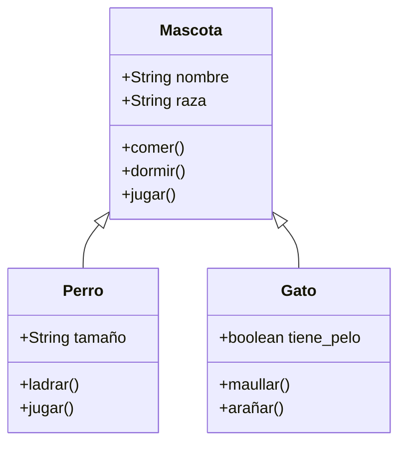

# Herencia

En POO, la herencia es uno de los conceptos más importantes ya que nos permite potenciar el uso de clases y aumentar la productividad del desarrollo de software al simplificar la detección de errores.

La herencia es una relación entre clases en las que existe un clase padre, **superclase**, y una o más clases hijas especializadas, **subclases**. La relación de herencia entre clases, al igual que en la biología, nos permite pasar los atributos y métodos de una clase padre a sus clases hijas y estas a la vez pueden mejorar o especializar sus funcionalidades.

```java

public class Vehiculo {
	public String marca = "Mazada";
	public String matricula = "WZ4-5HC";

	public void avanzar(){
		System.out.println("Estoy avanzando");
	}
}

public class Carro extends Vehicle{
	public String modelo = "Mazda 3";
}

```

El código anterior nos muestra dos clases, *Vehiculo* y *Carro*, de las cuales una extiende, para ello la palabra reservada *extends*, de otra. Lo que sucede es que la clase *Carro* va a contar con todos los atributos y métodos de la clase vehículo dado que internamente un *Carro* también es un  *Vehículo*.

```java

Carro c = new Carro();

System.out.println(c.modelo); // Salida - "Mazda 3"
System.out.println(c.marca);  // Salida - "Mazda"

c.avanzar; // Salida - "Estoy avanzando"

```

Con el ejemplo anterior podemos observar como un objeto de la clase *Carro* hace uso de la clase *Vehiculo* de la cual extendió.

---
# Polimorfismo

El polimorfismo y la herencia son dos conceptos íntimamente ligados, la herencia como se vio anteriormente nos permite heredar entre clases los atributos y métodos de *superclases* a *subclases* por lo que podemos entender que una clase hija también es en si la clase padre al tener todas sus características. Pero ahora consideremos lo siguiente:

¿Qué pasa si existen múltiples objetos que puedan tener el mismo comportamiento en común pero con algunos otros particulares? Como por ejemplo un gato y un perro, ambos comparten varias características pero nos enfocaremos en que ambos pueden ser mascotas. Para representar este caso veamos el siguiente diagrama.



Como podemos observar se ha declarado que tanto el perro como el gato son mascotas, ambos extienden de la clase mascota obteniendo todos sus atributos y métodos pero también cada uno de ellos tiene sus propios atributos y métodos específicos.

El concepto de polimorfismo nos indica que un objeto puede tener múltiples formas y conjunto a la herencia podemos verlo claramente, la clase mascota puede estar presente por si sola, adaptarse conjunto a la clase perro y en paralelo hacerlo con la clase Gato.

Es importante tener en cuenta que en Java no existe la herencia múltiple donde una subclase herede de varias superclases, sin embargo existen métodos para emular este estado. Para ello se debe hacer uso de técnicas un poco más avanzadas que no se ven en esta nota. Se sugiere estudiar sobre Desarrollo orientado a objetos.

## Upcasting y downcasting

Uno de los conceptos más importantes del polimorfismo y herencia es sobre la conversión de un tipo de dato a otro, *Cast*, y entre clases con jerarquía de herencia es fundamental. Los dos tipos de conversión de datos con herencia son el ***Upcasting**** y ***Downcasting*** que se refieren a pasar de un tipo de una superclase a una subclase y viceversa.

### Upcasting

El *Upcasting* se lleva acabo cuando convertimos de un clase hija, subclase, a una clase padre, superclase, esta conversión de tipo de dato se puede hacer de manera implícita o explícita osea que podemos declarar en código y definir el nuevo tipo de dato, o dejar que el compilador sea quien lo haga.

```java

public class Parent{
	public void printInfo(){
		System.out.println("Metodo padre");
	}
}

public class Child extends Parent{
	@Override
	public void printInfo(){
		System.out.println("Metodo hijo");
	}
}

```

Para instanciar un objeto con herencia vimos anteriormente que creábamos un objeto de tipo hijo, es la forma básica de creación de objetos. En el siguiente ejemplo vamos a adaptar un objeto de clase hijo e instanciarla como tipo padre.

```java

Child c = new Child();    // Forma básica de crear un objeto Child

Parent p1 = new Child();  // Upcasting implicito

Parent p2 = c;            // Upcasting explicito

```

Como vemos en el ejemplo convertimos un objeto de hijo a uno de tipo padre y se mostró dos maneras de hacerlo. La conversión implícita se puede llevar acabo ya que la clase *Child* extiende de *Parent* por lo que en si un objeto *Child* es también un objeto *Parent*.

Una vez que se hace la conversión de datos, la variable solo puede hacer uso de los atributos y métodos de la clase padre, no podrá acceder a los de la clase hija dado que ahora no existen para si, sin embargo los métodos y atributos heredados que la clase hija modifique si se aplicarán.

```java

Parent p = new Child();  // Upcasting implicito

p.printInfo();           // Salida: Metodo hijo

```

### Downcasting

El *Downcasting* se lleva acabo cuando convertimos de un clase padre, superclase, a una clase hija, subclase, esta conversión de tipo de dato solo se puede hacer de manera explícita declarando en código y definiendo el nuevo tipo de dato al que se convertirá.

```java

public class Parent{
	public void printInfo(){
		System.out.println("Metodo padre");
	}
}

public class Child extends Parent{
	@Override
	public void printInfo(){
		System.out.println("Metodo hijo");
	}
}

```

Cuando ser instancie un objeto y se haga un conversión *Downcasting* la variable ahora podrá acceder a los atributos agregados por la clase hija. Es importante saber que el *Downcasting* sirve para revertir el *Upcasting*.

```java

Parent p = new Parent();
Child c = p; 

// ERROR, no se puede castear así de Parent a Child

```

```java

Parent p = new Child(); // Upcasting
Child c = p;            // Downcasting
// Child c = (Child) p;    Se puede especificar el tipo de cast

c.printInfo();          // Salida: Metodo hijo
  
```