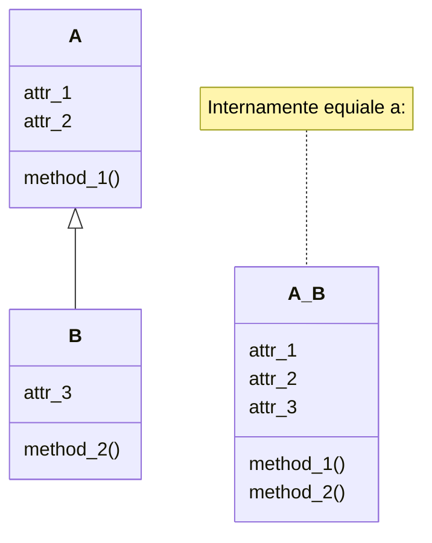
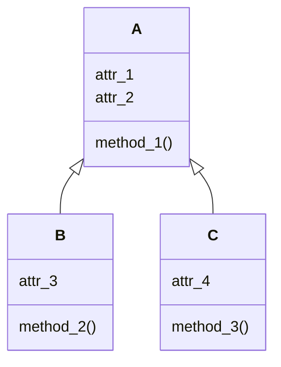
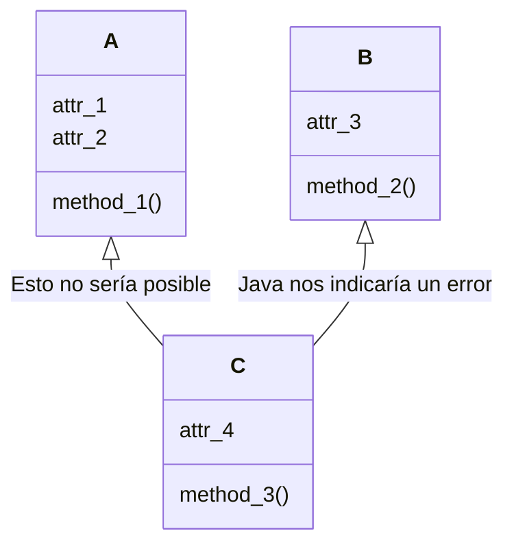
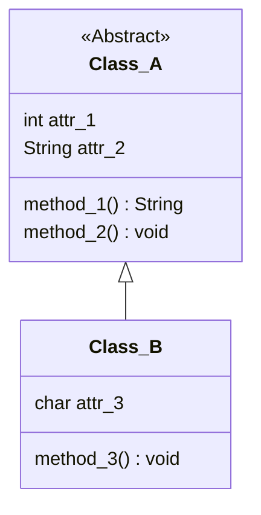
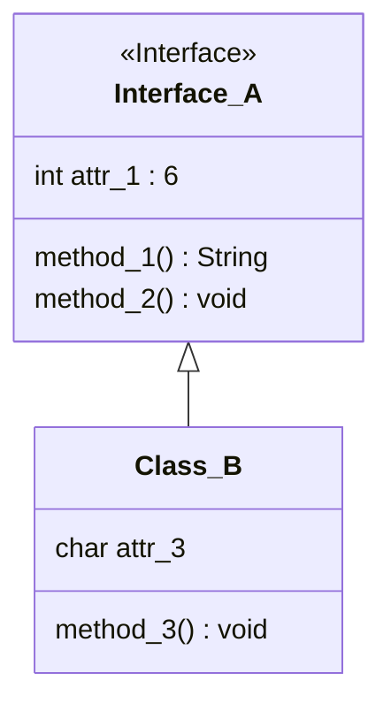

La construcción y diseño de clases es uno de los fundamentos más importantes a aprender cuando se inicia en el mundo de Java, el concepto de lo que son los objetos y la abstracción a clases es un paso importante. El siguiente gran paso es empezar a entender lo que es la herencia, como los atributos y métodos de una superclase pueden pasar a otras subclases y estas especializarse para mejorar o desarrollar nuevas tareas. La introducción a estos temas se encuentra en la nota sobre [[1. POO | Programación Orientada a Objetos]] en la sección sobre [[2. Clases y Objetos | Clases y objetos]], la sección de [[5. Herencia y Polimorfismo#Herencia|  Herencia]] y de [[5. Herencia y Polimorfismo#Polimorfismo | Polimorfismo]].

>[!consejo]
> En esta nota se habla un poco más a profundidad de la creación de clases, los tipos de clases que existen y como utilizar la herencia con cada una de ellas. Se recomienda tener ya el concepto, aún siendo básico, de lo que son Clases, Objetos, Herencia, Polimorfismo y conocer sobre diagramado de clases con UML.

---

<br>

# Tipos de clases y su herencia
---
---

En esencia las clases como las conocemos pueden heredar y ser heredadas, funcionando como un sistema de jerarquía de clases donde las subclases tendrán mayor especialización y cumplirán con propósitos más específicos a lo de las superclases.

Breve recordatorio hasta el momento:

* Las clases pueden heredar métodos y atributos de otras clases.

* Una superclase puede heredar a varias subclases.

* Una subclase no puede heredar de varias superclases.


Con estos conceptos podemos arrancar e indagar en otros tipos de clases que pueden cambiar su comportamiento o forma de llevar la herencia.

<br>
<br>

## Clases abstractas
---

El primero de los tipos de clases a ver son las las clases abstractas, estás no difieren mucho de las clases normales como las conocemos pero veamos sus diferencias, uso y manera de extender, o heredar.

Una clase a abstracta, a diferencia de una que no lo es, es que incluye métodos abstractos. Al definir una clase abstracta estamos indicando que esa clase contendrá métodos los cuales aún no tendrán definido un comportamiento por lo que este comportamiento deberá ser especificado por sus subclases.

A continuación podemos observar un ejemplo de la lógica de creación y extensión de una clase abstracta, recodemos que la clase abstracta se caracteriza por poder contener métodos abstractos sin embargo igual puede contener atributos y extender de otras clases abstractas o no. 



En el ejemplo vemos que la clase **Class_B** extenderá de clase **Class_A**, por lo que en el código de clase A al menos algún método podrá ser abstracto, o en otras palabras el método se encontrará vacío sin un comportamiento ya definido. Los métodos que se declaren como abstractos deberán ser sobrescritos y definidos por sus subclases como se muestra en el código siguiente.

```java

public abstract class Class_A{
	public int attr_1;
	public String attr_2;
	public abstract String method_1();
	public void method_2(){
		System.out.println("Hola soy clase abstracta");
	}
}

public class Class_B extends Class_A{
	public char attr_3;
	@Override
	public String method_1(){
		return  "Sobrescritura de method_1, " +
				"en este caso es obligatorio ya " +
				"que extiendo una clase abstracta";
	}
	public void method_3(){
		System.out.println(this.method_1());
	}
}

```

Como logramos observar en el código anterior, para declarar una clase abstracta debe llevar el prefijo *abstract*, de la misma manera manera sucede con los métodos que sean abstractos. En una clase abstracta no es forzoso que todos los métodos sean abstractos. 

Una vez extendida la clase abstracta se puede pasar a crear objetos de sus subclases.

```java

Class_B b = new Class_B();
b.method_3(); 

/*
Salida :
	Sobrescrito de method_1, en este caso es obligatorio ya que extiendo una clase abstracta
*/

```

> [!importante]
> Algo que se debe tomar en cuenta es que no se pueden crear objetos de una clase abstracta, por lo que siempre deberá heredar a una subclase la cual pueda ser instanciada.

```java

Class_A a = new Class_A(); // ERROR - No se pueden crear clases abstractas

```

<br>
<br>

## Interfaces
---

Una interfaz es una clase completamente abstracta, tiene las mismas características que una clase abstracta, puede tener atributos, ser extendida (en este caso se es implementada por sus subclases), extender de otra interfaz y no puede ser instanciada salvo por sus subclases; los métodos de una interfaz deben ser todos abstractos, no es necesario declararlos como abstractos ya que el compilador entiende que es una interfaz.



Retomamos el ejemplo visto en clases abstractas y ahora lo hacemos implementando interfaces. Para poder crear una interfaz se utiliza la palabra reservada ***interface*** en lugar de ***class***.

```java

public interface Interface_A{
	int ATTR_1 = 6;
	String method_1();
	void method_2();
}

public class Class_B implements Interface_A{
	public char attr_3;
	@Override
	public String method_1(){
		return  "Sobrescritura de method_1, " +
				"en este caso es obligatorio ya " +
				"que extiendo una interfaz";
	}
	@Override
	public void method_2(){
		System.out.println("Hola vengo de una interfaz");
	}
	public void method_3(){
		System.out.println(this.method_1());
	}
}

```

Una vez implementada la interfaz por una subclase ya se pueden crear objetos de la siguiente manera.

```java

Class_B b = new Class_B();
b.method_3(); 

/*
Salida :
	Sobrescrito de method_1, en este caso es obligatorio ya que extiendo una interfaz
*/

```

>[!importante]
>Las interfaces tienen algunos detalles a considerar:
>* Los atributos de una interfaz son por default ***public***, ***final*** y ***static***.
>* Los métodos de una interfaz son por default ***abstract*** y ***public***.
>* Las interfaces no pueden ser usadas para crear objetos.
>* Todos los métodos, al ser abstractos, deben ser sobrescritos.
>* Las interfaces no pueden extender de otras superclases ni implementar otras interfaces, solamente pueden extender de otra interfaz.

<br>
<br>

## Enum
---

Un **Enum** es una clase especial, esta en esencia no puede ser heredada ni heredar aunque existen métodos avanzados para emularlo, la cual representa un grupo de constantes con variables las cuales son inmutables.

Para entender como funcionan los *Enum* vamos a realizar distintos ejemplos, el primero de ellos es la creación básica de un *Enum*. Para crear un *Enum* se utiliza la palabra reservada ***enum*** así como se utilizan las palabras *class* o *interface*.

```java

public enum Dias{
	LUNES,
	MARTES,
	MIERCOLES,
	JUEVES,
	VIERNES,
	SABADO,
	DOMINGO
}

```

Lo anterior es la declaración más básica de un *Enum* donde se le da un nombre y se le asignan variables finales. Para acceder a estas variables se utiliza el operador punto como si fueran variables *static* así como se ve a continuación:

```java

System.out.println(Dias.MARTES); // Salida: MARTES

```

Lo que se mostrara a la salida es MARTES, el valor de esa variable. Sin embargo también existen otras formas de utilizar un *Enum* y añadiendo valores para a sus variables.

```java

public enum Mes{
	ENERO(31),
	FEBRERO(28),
	MARZO(31),
	ABRIL(30),
	MAYO(31),
	JUNIO(30),
	JULIO(31),
	AGOSTO(31),
	SEPTIEMBRE(30),
	OCTUBRE(31),
	NOVIEMBRE(30),
	DICIEMBRE(31);

	private int dias;

	private Mes(int dias){
		this.dias = dias;
	}

	public int getDias(){
		return this.dias;
	}

}

```

Expliquemos que esta sucediendo en el código anterior:
1. Primero es la declaración de las variables constantes del *Enum*, en este caso el nombre de cada mes, seguido de cada variable tenemos entre paréntesis un valor, para cada mes del año se puso el número de días que tiene.
2. Posteriormente hay que agregar el valor a la cada variable, para ello declaramos la variable días y creamos un constructor de clase con el mismo nombre del *Enum* con el cual se le asignará el valor a la variable.
3. Por último agregamos un método con el cual acceder al valor que agregamos, en el ejemplo corresponde al método *getDias*.

Pero ¿cómo se usa el *Enum*? Para hacer uso de el existen dos formas, usar el operador punto como se vio en el ejemplo anterior o crear una instancia, no olvidemos que el *Enum* sigue siendo una clase. Veamos ambos ejemplos para observar el funcionamiento de cada uno.

```java

System.out.println(Mes.JUNIO.getDias()); // Salida: 30

```

Utilizando el operador punto vemos como podemos obtener el número de días que tiene el mes de junio, pero ¿cómo es posible si en ningún momento se ha declarado un objeto que sea junio?. Veamos el siguiente ejemplo donde crearemos unas instancia.

```java

Mes enero = Mes.ENERO;
System.out.println(enero.getDias()); // Salida: 31

```

En el ejemplo anterior vemos como se instancia en la variable enero y posteriormente se obtienen los días. ¿Por qué en ningún momento utilizamos la palabra *new* para crear el objeto? ¿En qué momento se creo el objeto?. 

Para responder las preguntas que vimos en los dos ejemplos de como acceder a los valores del *Enum* debemos recordar lo primero que se menciono sobre lo que es en si un *Enum*, un *Enum* es un grupo de variables constantes e inmutables, por ello:

* Todas las variables del *Enum* se escriben completamente en mayúsculas, al igual que se haría con una el nombre de una variable de tipo *final*. 
* Sobre la asignación de valores y creación de objetos, la estructura o clase *Enum* ya esta prevista por el compilador que serán objetos que jamas podrán cambiar por lo que se crean los objetos y se almacenan como variables constantes las cuales estarán disponibles justo en el momento que se les llame, ya sea por crear una instancia o por acceder a ellas con el operador punto, sin embargo para poder almacenar sus valores es importante registrarlos. 
* Para registrar los valores vimos que se debió crear un constructor, este es el que sirve para inicializar los valores de los objetos que son inmutables y se asignaran a las variables declaradas en el *Enum*, junto a las variables se especifican los valores con los que se inician a los objetos.
* Dependiendo del diseño del *Enum* es la forma de acceder a sus valores, en este ejemplo se declaro al atributo *dias* como una variable privada por lo que se debió crear al método *getDias* con el cual acceder a dicha información, sin embargo no descartemos que esta variable puede ser publica y el método no será necesario. El acceso a los valores depende del diseño del *Enum*, sin embargo por el principio de encapsulamiento se considera una buena practica tener un método que acceda la información y no manipular directamente los datos.

Veamos un último ejemplo de uso de un *Enum*:

```java

public enum PizzaStatus {
	ORDERED (5){
		@Override
		public boolean isOrdered() {
			return true;
		}
	},
	READY (2){
		@Override
		public boolean isReady() {
			return true;
		}
	},
	DELIVERED (0){
		@Override
		public boolean isDelivered() {
			return true;
		}
	};

	private int timeToDelivery;

	public boolean isOrdered() {
		return false;
	}

	public boolean isReady() {
		return false;
	}

	public boolean isDelivered() {
		return false;
	}

	public int getTimeToDelivery() {
		return timeToDelivery;
	}

	public PizzaStatus (int timeToDelivery) {
		this.timeToDelivery = timeToDelivery;
	}
}

```

En este último caso vemos como se declaro un *Enum* con el cual se puede obtener el estado en el que se encuentra una pizza que contiene una valor de tiempo para ser enviada. Lo importante a destacar en este último ejemplo es el uso de métodos, el *Enum* por si ya trae declarados una serie de métodos, sin embargo por cada variable se modifica y sobrescribe un método en especifico para poder obtener claramente la información en la que se encuentra la Pizza.

Como lo pudimos observar en el ejemplo anterior, también se puede hacer uso de métodos dentro de un *Enum* y ser modificados, estos mismos igual serán inmutables para cada objeto creado.