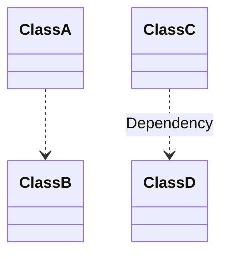
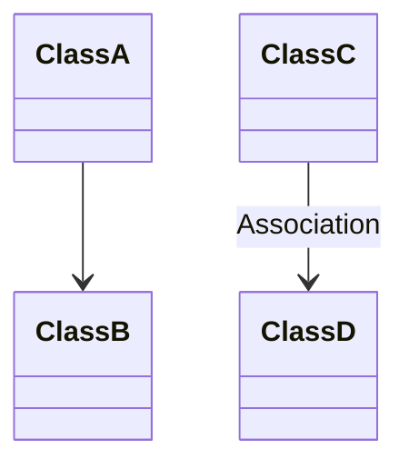
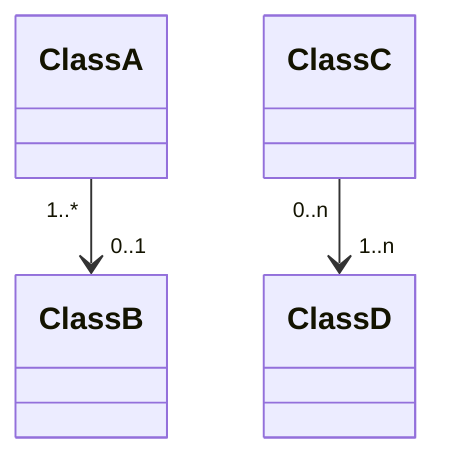
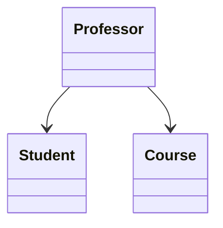
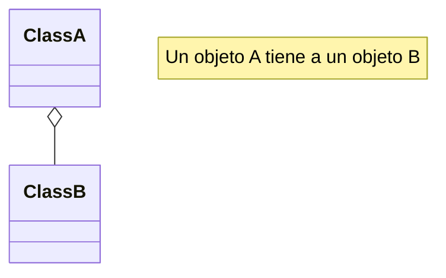
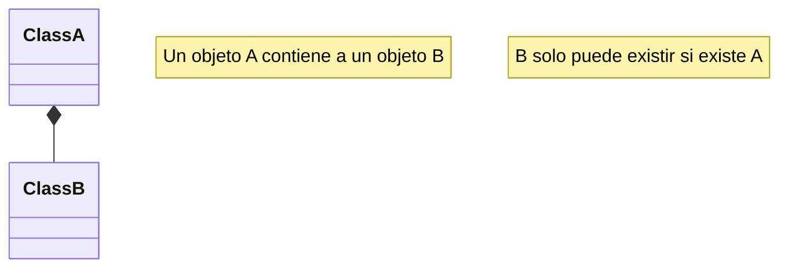
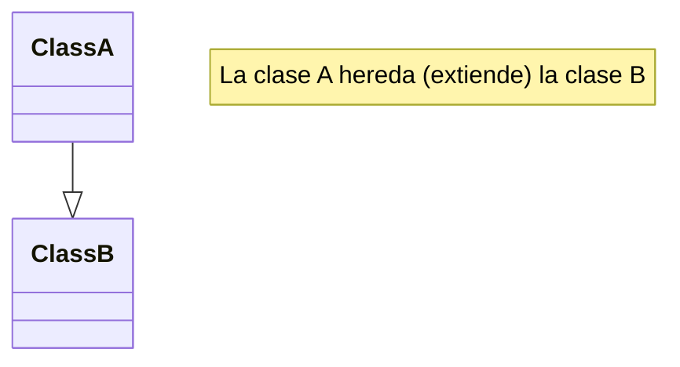
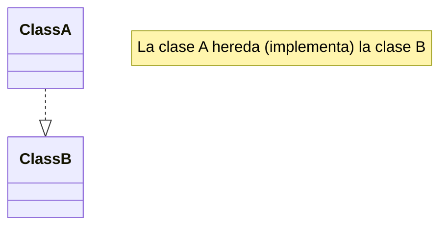

> Recomendable saber sobre los principios de la programación orientada a objetos y tener noción del UML.

<br>

# Relaciones entre objetos
---
---

Además de la *herencia* y *implementación* (siendo esta la herencia de una interfaz), hay otros tipos de relaciones entre objetos. Todas estas relaciones se intentan explicar más adelante y se observarán su diseño con UML para poder representarlo de una manera gráfica.

<br>
<br>

## Dependencia
---

La *dependencia* es el tipo de relación más básica y débil entre clases. Existe una dependencia entre os clases cuando ciertos cambios en la definición de una clase puede provocar modificaciones en otra. La dependencia ocurre normalmente cuando se usan nombres de clases concretas en el código.

La dependencia puede representar la relación entre dos clases donde una utiliza a la otra ya sea por su relación directa en código, el uso entre sus atributos o el uso de sus métodos. 

Normalmente, un diagrama UML no muestra todas las dependencias, hay demasiada en cualquier código real. Se suelen representar solo las dependencias importantes para lo que sea desea comunicar.



La dependencia se suele representar con una flecha de línea discontinua desde la clase que necesita de la utilidad a la clase que la brinda.

<br>
<br>

## Asociación
---

La *asociación* es una relación en la que un objeto utiliza o interactúa con otro. Existen la asociación unidireccional como bidireccional. 

En general, se utiliza la asociación para representar algo como un campo en una clase. El vinculo siempre esta ahí, en cuanto a que siempre puede pedir una orden para su cliente.

No siempre tiene que ser un campo. Si estás modelando tus clases desde una perspectiva de interfaz, puede simplemente indicar la presencia de un método que devolverá el cliente de la orden.



La asociación suele representar con una flecha de linea solida desde la la clase A a la clase B, donde la clase A hace uso de la clase B.

La asociación también puede especificar la cardinalidad que tienen las clases.



### Ejemplo: Dependencia y Asociación

```java
class Professor is
	field Student student
	// ...
	method teach(Course c) is
	// ...
	this.student.remember(c.getKnowledge())
```

Observa el método `teach`. Toma un argumento de la clase `Course` que después se utiliza en cuerpo del método. Si cambia el método `getKnowledge`de la clase `Course` nuestro código se descompondrá. Esto se llama dependencia.

Si observamos el campo `Student` y cómo utiliza en el método `teach` podemos afirmar con seguridad que la clase `Student` también tiene de dependencia con la clase `Professor`. No obstante, como el campo `Studen` siempre está accesible para cualquier método de `Profesor`, la clase `Student` no es sólo una dependencia, sino también una asociación.



<br>
<br>

## Agregación
---

La *agregación* es un tipo especializado de asociación que representa relaciones entre múltiples objetos. 

Con la agregación un objeto "tiene" un grupo de otros objetos y sirve como contenedor o colección. El componente puede existir sin el contenedor y puede vincularse a varios contenedores al mismo tiempo.



La agregación se representa con una linea solida que une dos clases donde la la clase contenedora tendrá un diamante vacío de su lado. También se puede integrarla cardinalidad entre las clases.

<br>
<br>

## Composición
---

La *composición* es un tipo más especializado de asociación y agregación en la que un objeto se compone de una o más instancias de otro objeto. La diferencia entre ésta y otras relaciones está en que el componente sólo puede existir como parte del contenedor.



La composición suele representar con una línea solida que une dos clases, donde la clase contenedora tiene un diamante solido. Se puede indicar la cardinalidad entre las clases, sin embargo, ya que el objeto contenido solo tiene razón de existir por la clase contenedora no deberá tener una cardinalidad mayor a 1.

<br>
<br>

## Generalización
---

La *Generalización* o mejor conocida como ***Herencia***, ya se ha visto en la sección [[5. Herencia y Polimorfismo#Herencia | Herencia]].

La Generalización suele representarse con una flecha de linea solida y con punta cerrada. La dirección va en sentido de la clase *Hija* a la clase *Padre*.



Existe un segundo tipo de representación, también puede ser conocida como *Realización* que básicamente es la la herencia de una interfaz, también conocido como *implementación*. Se puede representar de la misma manera a la *Herencia* salvo la linea es discontinua.



<br>
<br>

## Resumen

Haciendo un resumen de los conceptos de relación entres clases intentamos que quede claro la diferencia y uso de cada uno, si bien algunos solo son especializaciones de otros es importante saber que caracteriza a cada uno.

> [!summary]- **Dependencia**
> La clase A puede verse afectada por los cambios en la clase B.
> ```mermaid
> classDiagram
> ClassA ..> ClassB
> note "La clase A depende de la clase B"
> ```

> [!summary]- **Asociación**
> La clase A conoce y puede usar a la clase B. La clase A depende de la clase B.
> ```mermaid
> classDiagram
> ClassA --> ClassB
> note "La clase A conocer y depende de de la clase B"
> ```

> [!summary]- **Agregación**
> La clase A conoce a la clase B. La clase A depende de la clase B. Los objetos de la clase B pueden ser contenidos por objetos de la clase A.
> ```mermaid
> classDiagram
> ClassA o-- ClassB
> note "Un objeto A tiene a un objeto B"
> ```

> [!summary]- **Composición**
> La clase A conoce a la clase B. La clase A depende de la clase B. Los objetos de la clase B solo pueden ser contenidos por objetos de la clase A. La existencia de un objeto B no tiene sentido sin un objeto A.
> ```mermaid
> classDiagram
> ClassA *-- ClassB
> note "Un objeto A contiene a un objeto B"
> ```

> [!summary]- **Generalización**
> > [!example] ***Herencia***
> > La clase A extiende de la clase B.
> > ```mermaid
> > classDiagram
> > ClassA --|> ClassB
> > note "La clase A hereda (extiende) a la clase B"
> > ```
> 
> > [!example] ***Implementación***
> > La clase A implementa a la clase B.
> > ```mermaid
> > classDiagram
> > ClassA ..|> ClassB
> > note "La clase A hereda (implementa) a la clase B"
> > ```