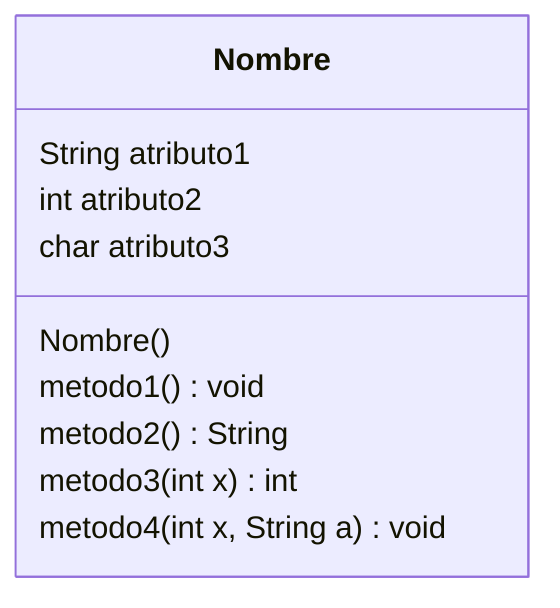
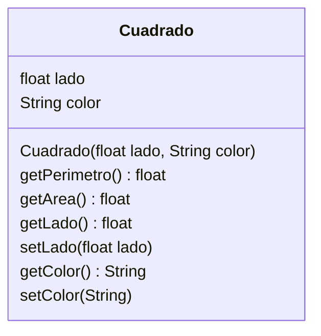
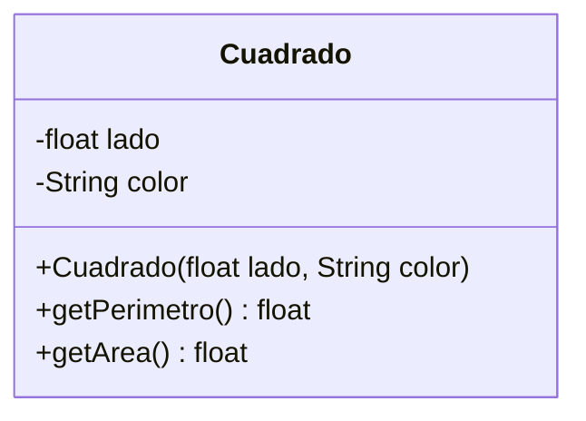
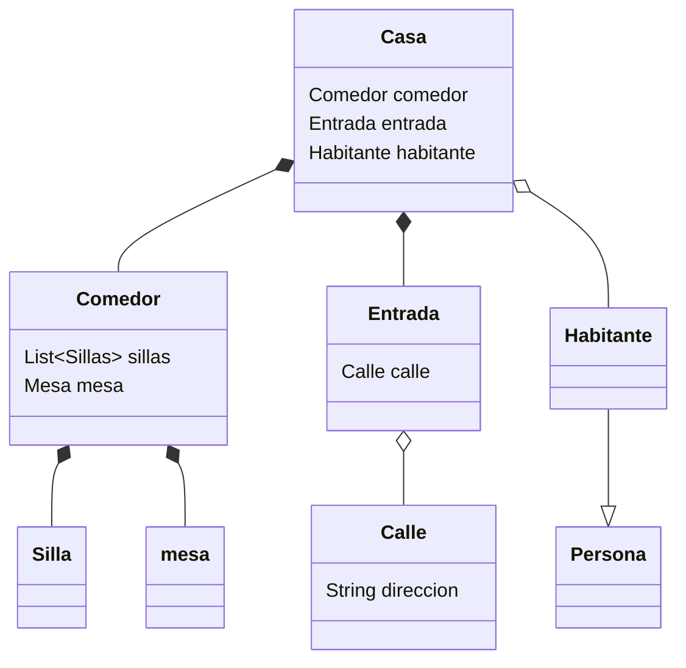
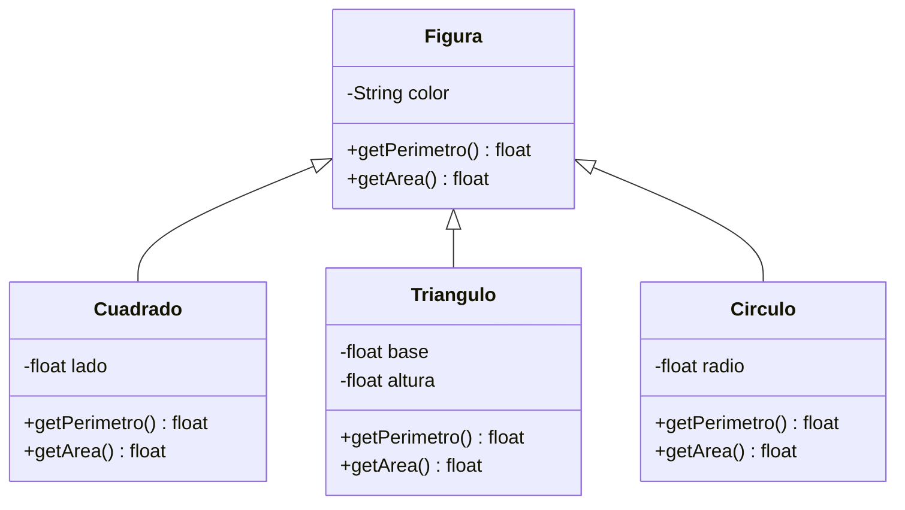
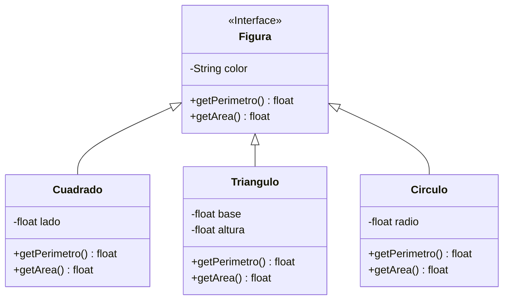
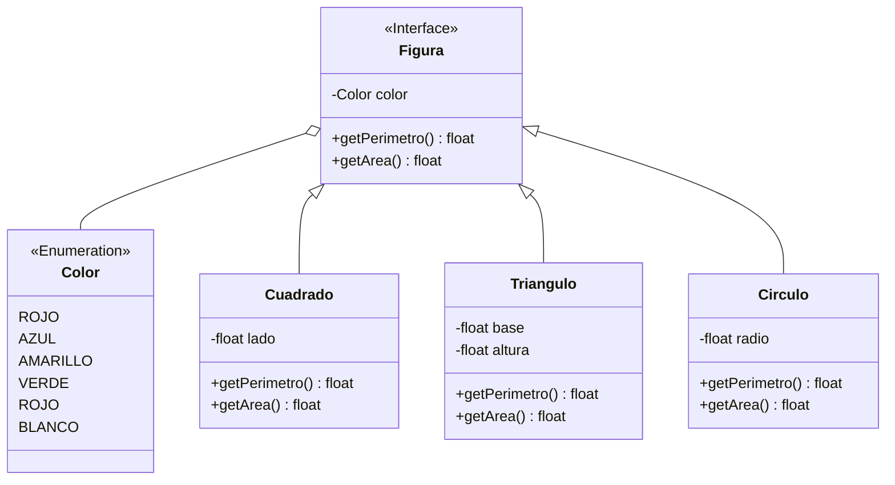
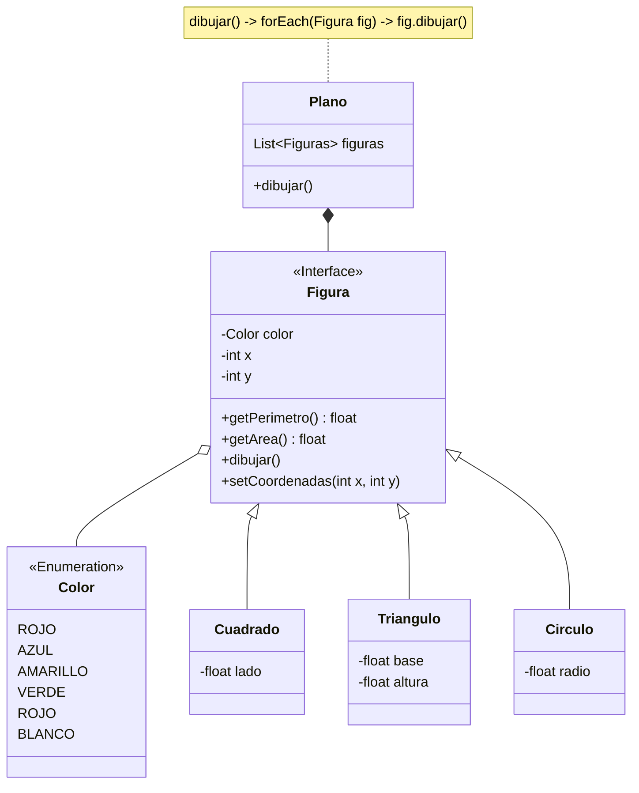

# UML
---
---

El ***lenguaje unificado de modelo***, **UML** por sus siglas en inglés (Unified Modeling Language) es el lenguajes de modelado de sistemas de software más conocido y utilizado en la actualidad, respaldado por el ***Object Management Group*** (OMG).

Es un lenguaje gráfico para visualizar, especificar, construir y documentar un sistema. UML ofrece un estándar para describir un "plano" del sistema (modelo), incluyendo aspectos conceptuales tales como procesos, funciones del sistema, y aspectos concretos como expresiones de lenguajes de programación.

Es importante aclarar que UML no es programación solo se diagrama la realidad de una utilización en un requerimiento. La [[1. POO | POO]] ha sido un complemento perfecto de UML, pero no por eso se utiliza UML solo para lenguajes orientados a objetos.

UML nos ayuda a modelar un sistema, para ello existen distintos tipos de diagramas, cada uno con su propias características y propósitos. A continuación nos enfocaremos en el Diagrama de clases, esencial para poder trabajar y comunicarse si se utiliza POO.

 

# Diagrama de clases
---
---

Un *diagrama de clases* en *UML* es un tipo de diagrama de estructura estática que describe la estructura de un sistema mostrando las clases del sistema, sus atributos, operaciones (o métodos) y las relaciones entre los objetos.

El miembro principal de este diagrama, como su nombre lo dice, es la *clase*. Como ya vimos en la sección sobre [[2. Clases y objetos#Clase|Clases]] estas tienen atributos y métodos. Los métodos más comúnes de cada clase son los llamados [[4. Encapsulamiento#Getters and Setters| Getters and Setters]], al igual que todas las clases implementan un [[2. Clases y objetos#Constructores y destructores | constructor]], o más ya sea el caso.

También ya hemos visto que a las clases se puede modificar su visibilidad y limitar su acceso con [[4. Encapsulamiento#Access Modifiers| modificadores de acceso]], así como cambiar función con [[4. Encapsulamiento#Non-Access Modifiers|modificadores de no acceso]].

Otros dos temas importantes que se han visto son los [[6. Tipos de clases|tipos de clases]] así como lo que es la [[5. Herencia y Polimorfismo| herencia]]. Posteriormente aprendimos sobre las [[7. Relaciones entre objetos | relaciones entre objetos]].

Toda la información que ya hemos aprendido de manera conceptual, también la hemos representado en algunos casos con diagramas. Con UML podemos representar toda la información anterior en un diagrama de clases.

> [!importante]
> Un diagrama de clases podrá ser tan específico como sea requerido. En muchas ocasiones no es completamente necesario representar con exactitud cada elemento del modelo, bastará con poner la información necesaria para lograr dar a entender lo que se requiere.
> 
> El concepto de [[3. Abstracción | abstracción]] es completamente necesario para poder diseñar y representar la realidad en un modelo, según el contexto que se necesite.
> 
> Ten en cuenta que se pueden hacer distintos diagramas de un solo modelo en los que cada uno cubra un aspecto del modelo global y de igual forma cada una puede representar un nivel de abstracción distinto.

 
 

## Elementos del diagrama
---

En esta sección vamos a ver los elementos que lleva un diagrama de clases con su representación gráfica. Primero partiremos de la representación de una clase.

==La representación de una clase== esta dado por un rectángulo divido de en tres secciones. La primer sección llevará el nombre de la clase y puede contener información adicional relacionada con el tipo de clase; la segunda sección contiene los atributos de la clase, el nombre de sus variables y el tipo de dato de cada atributo; la tercer y última contiene los métodos de la clase, se especifica si tendrá retorno, de tener el tipo de dato que retornará, y los parámetros requeridos por cada método. Tanto los atributos como los métodos de una clase pueden contener información adicional como sus modificadores de acceso.

El ejemplo anterior es el diseño general de una clase, se indica en la parte superior el nombre, podría ponerse información adicional ya sea el caso de una interfaz u otro tipo de clase, se especifican los atributos así como el tipo de datos para cada uno, y por último vemos la sección de métodos de la clase donde también se integra el constructor de la clase.

Veamos más ejemplos para dejar en claro la representación de una clase.

En el ejemplo anterior vemos una clase ***`Cuadrado`*** la cual tiene dos ***atributos***, *lado* y *color*, un ***Constructor*** que recibe un parámetro de tipo *flotante*, y varios ***métodos***, entre ellos los métodos *get* y *set*. 

> [!tip] 
>  ***Constructor*** de una clase, métodos ***Get*** y métodos ***Set*** pueden omitirse en el diagrama de una clase, se sobreentiende que estos pueden existir.

Como ya sabemos, existen ==modificadores de acceso==, estos se representan dentro de la clase y cada modificador estará junto a su atributo o método asociado.

La representación de cada modificador de acceso son los siguientes:

| Símbolo | Modificador |
| ------- | ----------- |
| +       | Público     |
| -       | Privado     |
| #       | Protegido   |

Ahora veamos utilizar estos modificadores de acceso en un ejemplo.

En el ejemplo anterior vemos a la misma clase `Cuadrado`, omitiendo los métodos *Get* y *Set*, utilizando modificadores de acceso para cada atributo y método.

Ya que sabemos como representar gráficamente es momento de comenzar a crear distintas clases y comprender como representar las ==relaciones entre los objetos== que se pueden crear.

En este ejemplo vemos distintas clases, la clase `Casa` contiene tres atributos que son otras clases. La relación que mantiene la clase `Casa`con las clases `Comedor` y `Entrada` es de composición ya que en concepto la existencia de un comedor y de una entrada no tendrían sentido si no existe una casa. También se tiene una relación con la clase `Habitante` siendo de agregación ya que un `Habitante` es en si una `Persona`, expresado con una relación de herencia, y en concepto una persona si puede existir sin que una casa exista.

El ejemplo anterior es uno básico y debe tener en cuenta que pueden existir muchos más aspectos para mejorarlo, con el uso de interfaces, otras clases, cambiar el tipo de relaciones, entre otras cosas.

## Ejemplo

Por último veamos otro ejemplo donde ahora representemos distintos tipos de clases. Para estudiar el siguiente ejemplo veremos distintos diagramas, donde el ejemplo ira evolucionando.

1. El primer diagrama podemos ver como una existen distintas figuras que van a heredar de la clase `Figura`.

2. En este segundo diagrama vamos a ver algunos cambios, la clase `Figura` se declarara como una interfaz.

3. Si bien el ejemplo anterior solo cambiamos la herencia a una interfaz, bien podría cambiarse la relación a una de implementación.

En realidad esta sería estrictamente la manera correcta de representar la implementación de una interfaz, pero en realidad basta con la representación de herencia para entender el concepto de que las clases heredarán el comportamiento. A nivel de código serán realmente especificadas según los requerimientos y el modelo diseñado, siempre y cuando este exponga la idea correcta sobre el diseño.

4. Regresamos al uso de la relación de herencia, siendo esta la representación más común. Observamos que todas las clases heredarán el atributo color, pero ahora este atributo vamos a extraerlo y convertirlo en una clase, específicamente en una clase *Enum*.

5. Ahora supongamos que estas clases de tipo `Figura` se van a dibujar en un `Plano` y se necesitan las coordenadas, si no existe un plano no hay razón para que existan las figuras. Veamos entonces una manera de hacerlo.

> [!importante]
> Como vimos un diagrama puede evolucionar, modificarse, implementar nuevas clases, cambiar el tipo de relaciones e implementar todos los elementos relacionados a una clase. Se puede ser tan especifico como se desee o como se requiera.