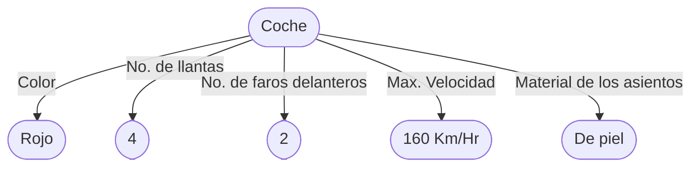
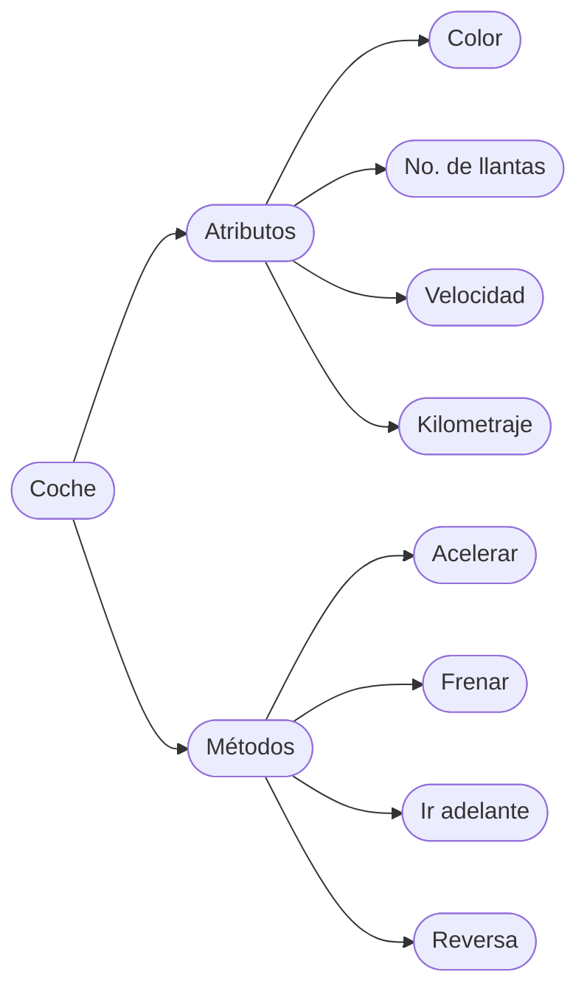
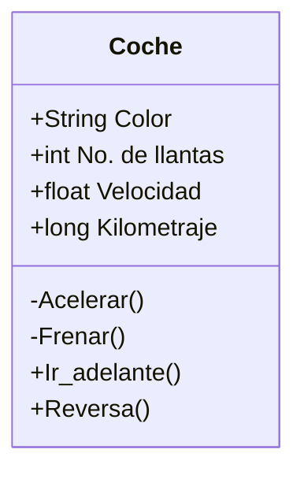
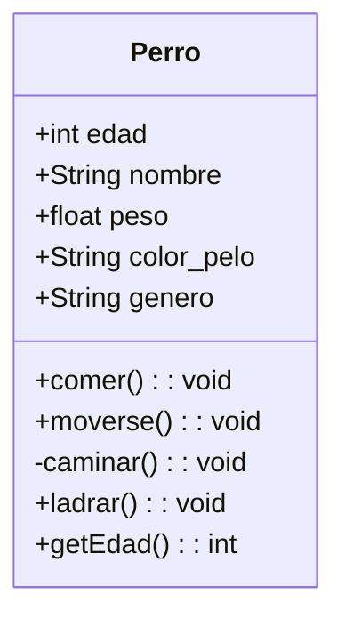
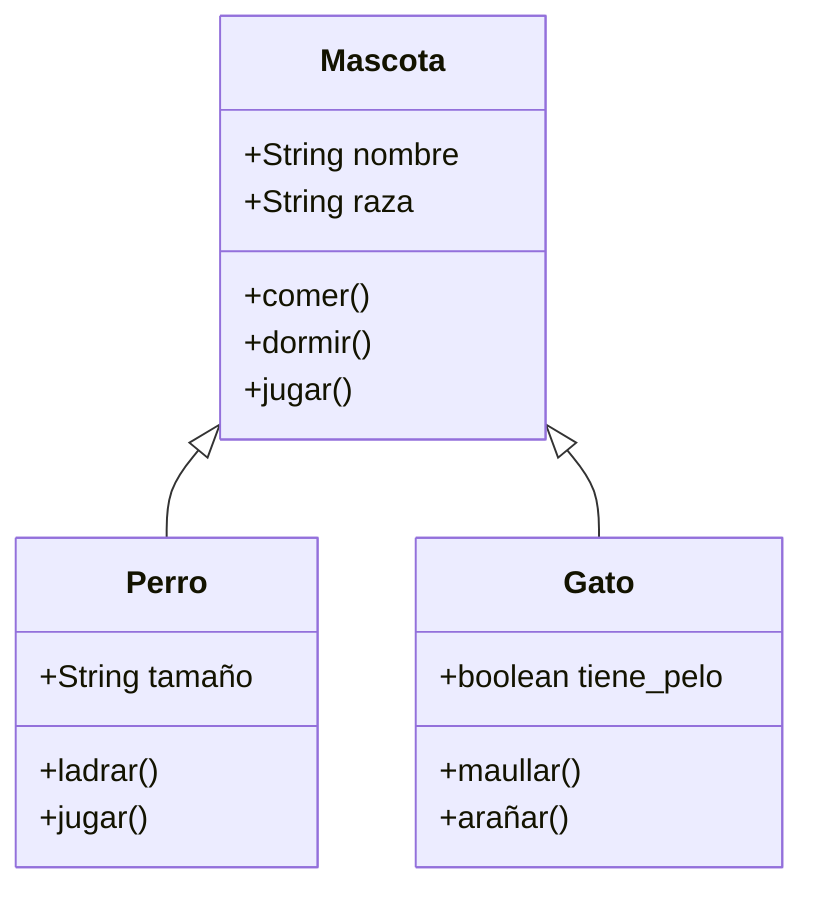

> En esta nota se encontrará la información esencial para poder introducirse y comprender de manera general los conceptos sobre la programación orienta a objetos.

# Programación Orientada a objetos (POO)

Antes de la POO, nace un nueva forma de pensar y ver las cosas para la resolución de problemas en el mundo del desarrollo de software, con esto nos referimos al paradigma orientado a objetos.

¿Qué es un paradigma? Un paradigma en una metodología que intenta unificar y simplificar la manera en que se resuelve un cierto grupo de problemas. En el contexto de la programación, un paradigma es un conjunto de principios y métodos que sirven para resolver los problemas a los que se enfrenta los desarrolladores de software al construir sistemas grandes y complejos. Existen diversos paradigmas de programación, por ejemplo:

* Programación estructurada: Se basa en estructuras de control de flujo de programa. No existen saltos entre rutinas, el flujo es continuo, haciendo que los programas sean más fáciles de entender.
* Programación funcional: Se programa con funciones que son llamadas bajo demanda. La programación de pequeños segmentos de código, funciones, promueve la reutilización de código y simplifica el entendimiento de las funciones. 
* Programación orienta a objetos: Los programas trabajan con base en unidades llamadas objetos. Todo esto se explica más adelante.

La programación orientada a objetos esta basada bajo el concepto de clases y objetos. Este tipo de programación se utiliza para estructurar un programa de software en piezas simples y reutilizables, en ello entran las clases las cuales serán el modelo o planos que definen el objetivo y comportamiento de cada sección de código. El objetivo de esta forma de programar es pensar objetos, su construcción, su funcionalidad y su interacción junto con otros objetos.

El paradigma orienta a objetos es útil cuando el sistema se modela de forma casi análoga a la realidad, porque así se simplifica el diseño de alto nivel. Esta analogía permite que los programadores tengan más claro cuál es el papel de cada porción del código y de los datos, lo que facilita la creación y el mantenimiento del sistema, promueve la reutilización de código por ejemplo en la implementación de clases abstractas (esto se verá mas adelante).

Para comprender la programación orientada a objetos se debe de entender los conceptos bajo los cuales esta pensado, el primero de ellos son las clases y lo objetos.

---
## Clases y Objetos

Las clases y los objetos son el eje central del paradigma orientado a objetos, debemos entender lo que son y sus diferencias para no utilizar estos conceptos de manera indistinta.

### Objeto

Lo primero es hablar acerca de objetos, un objeto es una entidad que puede ser tangible o no, cada objeto tiene un conjunto de características y funciones, con ello sabemos que los objetos tendrán estados y comportamientos.

* _Estado_: Son los datos asociados con el objeto que nos indican la situación en la que se encuentra, como por ejemplo un objeto puede tener una velocidad, capacidad de carga, volumen, calificación, color, encontrarse encendido/apagado, etc.
* _Comportamiento_: Es la manera en la que el objeto responde a estímulos, como por ejemplo lo que sucede cuando un botón es presionado, cuando la gasolina de un automóvil se ha terminado o lo que sucede cuando se hace un retiro de una cuenta bancaria.

En este punto nos acercamos al concepto de clases por lo que ahora debemos comprender que las características de un objeto las llamaremos ahora ___atributos___ y sus funciones o comportamientos pasaremos a conocerlos como ___métodos___.

Para entender estos conceptos vamos a utilizar un ejemplo que intente dejar claro lo que son. Partiremos desde el hecho de que un coche es un objeto y si deseamos abstraerlo para poder hacer una representación informática de el, debemos observar las características y funcionalidades que tiene o puede tener un coche. Para empezar con este ejemplo observemos el siguiente coche:

![[coche_rojo.jpg | center | 350]]

Algunas de las características del coche anterior son las siguientes:



Comencemos mencionando que las característica del color es completamente observable, sin embargo el no. de llantas es algo intuitivo ya que no observamos en su totalidad las 4 y en un hipotético caso tal vez nos encontremos un auto con más llantas. Algo más por resaltar son las características de máxima velocidad y el material de los asientos, si bien no son características que observemos en la imagen o exista algún indicio, supondremos que estas son las características de este coche en particular.

![[coches.jpg | center | 300]]

Ahora si observamos la imagen anterior vemos un tipo de coche distinto, y cada uno de diferente color, tal vez sus interiores sean distintos al coche rojo que vimos anteriormente, sin embargo todos cumplen la condición de que son coches, automóviles. En este punto debemos comenzar a hablar de lo que es una clase.

### Clase

Con el concepto de objeto logramos observar que cada objeto tiene características particulares, sin embargo como objetos podemos encontrar características comunes. Si bien en el ejemplo de objetos se limito a mencionar características el mismo concepto se extiende a sus funcionalidades, retomando el ejemplo de un coche podemos mencionar que una función de un coche puede ser el acelerar o el bajar las ventanas, sin embargo podemos observar que distintos objetos coche tienen la misma funcionalidad.

Entonces ¿qué pasa cuando tenemos características y funcionalidades que distintos objetos tienen en común? en este punto toma relevancia el concepto de clase.

Una clase es la abstracción que podemos formar alrededor de uno o más objetos, esta abstracción podemos concebirla como una plantilla. Ahora bien, en programación podemos decir que una clase es un tipo de dato definido por el programador específicamente para crear objetos. Intentemos ahora unir las dos definiciones anteriores para poder conceptualizar claramente lo que es una clase.

Sigamos con el ejemplo del coche, ya vimos que teníamos distintos objetos que eran todos coches pero cada uno podía tener sus particularidades, intentemos generalizar lo que es un coche para poder crear la clase coche.



Como podemos ver, la clase a diferencia del objeto no me dice cuales son las particularidades de un objeto, no me dice el color del coche, si no que me dice que características (atributos) y funcionalidades (métodos) son las que definen lo que es un objeto, para este ejemplo lo que es un coche.

Es importante aclarar que la clase coche puede ser definida de muchas maneras, el ejemplo solo muestra una de ellas, la definición de la clase coche puede variar según el uso que le va a dar a la clase, lo que se necesite tener en cuenta en el proyecto o programa en el que utilizaremos el coche, por lo mismo podemos entender que la clase coche podrá tener más o menos atributos y métodos.

Por último, la manera más común de representar una clase es utilizando UML, si interesa busca lo que es ya que aquí no se explica. Siguiendo el ejemplo del coche se describe a continuación esa clase.



Como lo podemos ver la clase como se muestra esta dividida en tres segmentos, el primero de ellos indica el nombre de la clase, el segundo apartado muestra los atributos de la clase y en el último encontramos los métodos. Se recomienda leer sobre UML y la definición de clases así como su diagramado.

### Instanciar objetos

Ya que tenemos definido lo que es una clase y un objeto es momento de adentrarnos a como llevar estos dos conceptos a código utilizando como lenguaje Java y de esta manera poder abordar el concepto lo que es una instancia, la instanciación o creación de instancias.

Una de las grandes ventajas de java con respecto a la programación orientada a objetos es que esta diseñado para poder solventar este paradigma de programación; así que empecemos por ver el código que se requiere para definir una clase, en esta ocasión representaremos todo con un ejemplo nuevo.



La clase *Perro* se puede escribir en código Java de la siguiente manera:

```java
public class Perro {
	public int edad;
	public String nombre;
	public float peso;
	public String color_pelo;
	public String genero;

	public Perro(/*int edad*/){
		//code
		//this.edad = edad
	}
	
	public void comer(){
		//code
	}
	
	public void moverse(){
		//code
	}
	
	private void caminar(){
		//code
	}
	
	public void ladrar(){
		//code
	}
	
	public int getEdad(){
		return this.edad;
	}
}
```

Se puede agregar más métodos para la visualización y modificación de los atributos, se pueden inicializar sus atributos con algún valor *default*,  entre otras cosas;  una de las cosas más importantes dentro del código de la clase es su constructor (este concepto se verá a fondo más adelante) el cual permite crear instancias de esta clase o lo que es lo mismo a crear objetos del tipo de la clase.

```java

Perro perro1 = new Perro();
Perro perro2 = new Perro();
Perro perro3 = new Perro();

```

Lo que vemos en el código de ejemplo anterior es como crear objetos de la clase perro, a esto se le llama crear una **instancia** . Crear una **instancia** significa crear un objeto que sea de un tipo de clase y asignarlo a una variable mediante la cual se podrá hacer uso del objeto; como lo vemos en el ejemplo de arriba se instanciaron 3 objetos de la clase *Perro* en las variables *perro1*, *perro2*, *perro3*. Una vez que se tiene la variable de un objeto se puede hacer uso de el, poder utilizar a sus métodos como acceder a sus atributos.

### Constructores y destructores

El constructor es uno elemento muy importante de la clase, es con lo que podremos instanciar objetos de la clase. El constructor de una clase va declarado dentro de la misma clase, debe tener el mismo nombre que la clase y puede o no recibir parámetros, esencialmente los parámetros que recibe el constructor son para inicializar el valor o cambiar los valores por default de la clase.

```java
public class Perro {
	public int edad;
	public String nombre;
	public float peso;
	public String color_pelo;
	public String genero;

	public Perro(){
		//super()
	}
}
```

El código que se muestra arriba es el ejemplo de un constructor vacío, no recibe ningún parámetro. Que no reciba parámetros no implica que forzosamente el constructor no realice nada, pueden asignarse valores por default como en el siguiente ejemplo.

```java
public class Perro {
	public int edad;
	public String nombre;
	public float peso;
	public String color_pelo;
	public String genero;

	public Perro(){
		//super()
		this.nombre = "Chispas";
	}
}
```

Es importante ver el siguiente ejemplo en el que dentro de la misma clase se tendrán más de un solo constructor, todos tendrán el mismo nombre sin embargo cada constructor cambia el número de parámetros que recibe e incluso pueden cambiar los parámetros que se solicitan.

```java
public class Perro {
	public int edad;
	public String nombre;
	public float peso;
	public String color_pelo;
	public String genero;

	public Perro(){
		//super()
	}
	
	public Perro(int edad){
		//super()
		this.edad = edad;
	}
	
	public Perro(int edad, String nombre, float peso){
		//super()
		this.edad = edad;
		this.nombre = nombre;
		this.peso = peso;
	}
	
	public Perro(int edad, float peso, String genero){
		//super()
		this.edad = edad;
		this.peso = peso;
		this.genero = genero;
	}
}
```

Todos los constructores funcionarán independientemente de contar con el mismo nombre, esto es una forma de **sobrecarga**, tema que se vera más adelante.

El tema ahora es como la llamada a un constructor en especifico siendo que todas las declaraciones del constructor son diferente, lo importante será el orden y el tipo de datos que se envien como parámetros, dependiendo del tipo y orden de datos que se agreguen a la llamada al constructor Java determinará a cual de los constructores se esta haciendo la llamada.

```java

Perro perro1 = new Perro();  //Se llama al constructor vacío
Perro perro2 = new Perro(3); //Se llama al constructor que agrega edad
Perro perro3 = new Perro(4. "Chispas", 21.5); /* Se llamada al constructor que agrega edad, nombre y peso*/

```

**Nota**: en los constructores se agrego como comentario la sentencia ```super()```, si se quitará la restricción como comentario, en este caso no sucedería nada, pero para otros ejemplos y declaraciones de constructores es importante, esto se ve en el tema de herencia.

### Sobrecarga de métodos

Anteriormente con los constructores vimos que se podían tener distintos constructores con el mismo nombre pero recibiendo distinta información y sin embargo al ser llamados Java determinaba por si solo que constructor era el correcto para cada llamada. A esto se le conoce como el principio de sobrecarga de métodos.

Realmente no solo se pueden crear distintos constructores de una clase, se pueden crear distintos métodos que contengan el mismo nombre y sin embargo la clase funcionará sin problemas. ¿Cómo es esto posible? Como se menciono antes, lo importante es el tipo de datos que se envían a al método que se llame y el orden en el que se proporcionen, con ello se podrá saber a cual de los métodos se esta haciendo referencia. Para poder entender este concepto veamos el siguiente ejemplo de una *calculadora*:

```java
public class Calculadora{
	public Calculadora(){
		//super()
	}

	public static suma(int a, int b){
		return a+b;
	}
	
	public static suma(float a, float b){
		return a+b;
	}
	
	public static suma(double a, double b){
		return a+b;
	}
}
```

En el ejemplo que se muestra se tiene a la clase Calculadora y se creo tres veces el método llamado suma, todos internamente realizan la misma operación, el comportamiento no obligatoriamente debe ser el mismo sin embargo para este ejemplo coincidió que todos los métodos realizaran la misma función, lo que diferencia la llamada de un método u otro será en este caso el tipo de datos que se proporcionen.

```java

Calculadora.suma(4, 5) //Se llama al método que utiliza enteros
Calculadora.suma(4.1, 16.023) //Se llama al método que usa flotantes

```

Para este ejemplo utilizamos la palabra ```static``` la cual es una palabra reservada como un modificador de acceso, como también lo son las palabras ```public``` y ```private``` que ya se han utilizado. Esto nos llevará al siguiente tema, encapsulamiento y ocultación de la información.

### La palabra reservada 'this'

La palabra reservada *this* nos sirve para referencia a la instancia de la variable de manera interna. Los atributos de una variable y los parámetros de su métodos pueden tener los mismos nombre por lo que al momento de hacer referencia de una variable por su nombre puede caer en una ambigüedad en la que el compilador no sabe a cual de las variables se refiere, por lo que el la palabra *this* no ayuda a superar esta ambigüedad como lo vemos en el siguiente ejemplo.

```java

public class Cuadrado(){
	public int lado;

	public setLado(int lado){
		lado = lado;
	}
}

```

En el ejemplo anterior intentamos dar valor al atributo lado mediante un método el cual esta recibiendo como parámetro un entero que lleva por nombre el mismo que el del parámetro, en este caso ¿cuál de las dos variables es la que se esta asignando? ¿se asigna el atributo o el parámetro? Lo que sucede realmente es que la variable que se esta utilizando para todo el método es la misma que la de la variable. ¿Cómo hacer que se modifique el valor del atributo de la clase? Para evitar ambigüedades como esta se utiliza la palabra *this* como se muestra a continuación.

```java

public class Cuadrado(){
	public int lado;

	public setLado(int lado){
		this.lado = lado;
	}
}

```

En este caso si es modificado el atributo asignando el valor pasado por el parámetro. 

---
## Encapsulamiento

El principio de encapsulamiento nos habla de como los objetos resguardan y ocultan su información, encapsulando sus datos, sus estados y comportamientos, de tal forma que solo el objeto pueda hacer uso de ellos sin exponerlos al exterior. De esta manera se asegura que la información de un objeto se encuentre oculta y solo el objeto sea responsable de sus estados, impidiendo que otros objetos o factores externos puedan modificarlos directamente si no solo a través de la interacción con el objeto.

La encapsulación esta íntimamente relacionado con los modificadores de acceso, los modificadores de acceso nos indican quien y desde donde se puede hacer uso de los atributos y métodos de un objeto, declarando estos modificadores desde la construcción de la clase.

```java

public class Persona_1{
	public String nombre;

	public Persona(String nombre){ç
		//super()
		this.nombre = nombre;
	}
}

public class Persona_2{
	private String nombre;

	public Persona(String nombre){ç
		//super()
		this.nombre = nombre;
	}
}

```

En el código anterior podemos ver dos clases *Persona_1* y *persona_2*, ambas contiene el atributo *nombre* que tiene la palabra reservada *public* y *private* respectivamente, de esta forma se declara que el atributo nombre es algo publico para la clase *Persona_1*, indicando que cualquiera y donde sea puede acceder para ver y modificar el nombre mediante el objeto, y privado para *Persona _2_*, nadie tiene acceso a el nombre más que el objeto mediante se propios métodos.

```java

Persona_1 p1 = new Persona_1("Jaime");
p1.nombre = "Rodrigo"; // Esto esta permitido por que el atributo es publico

Persona_2 p2 = new Persona_2("Pablo");
p2.nombre = "Pancho";  // ERROR, Esto no esta permitido ya que el atributo es privado

```

Para *Persona_2* expresamos que al atributo nombre podemos acceder mediante los métodos del objeto, para entender esto veamos el siguiente código.

```java

public class Persona{
	private String nombre;

	public Persona(String nombre){ç
		//super()
		this.nombre = nombre;
	}

	public String getNombre(){
		return this.nombre;
	}
	
	public void setNombre(String nombre){
		this.nombre = nombre
	}
}


```

En esta ocasión a la clase *Persona* se le declaro un atributo llamado *nombre* el cual *privado*, un constructor con el cual se da un valor al atributo y dos métodos públicos. Con los método agregados a esta clase podremos acceder al atributo tanto para poder obtener el valor, *getnombre*, como para modificarlo *setNombre*.

```java

Persona p = new Persona("Carolina"); // Instanciación
p.setNombre("Diana");                // Modificación del nombre
String a = p.getNombre();            // Acceso al nombre

```

El código anterior nos muestra como se puede ahora acceder a un atributo siendo este privado, mediante métodos propios de la clase. Es importante mencionar que podríamos crear otros métodos para la clase persona que utilicen de alguna forma el atributo privado, la creación de distintos métodos es dependiente del problema que se desee resolver y la abstracción que se tenga de los objetos al declarar las clases.

### Access Modifiers

Así como ya vimos los modificadores *public* y *private*, existen otros modificadores de acceso que veremos en esta sección.

Los modificadores de acceso sirven para limitar por niveles el acceso a la información. Cada modificador tiene sus particularidades, algunos nos permiten modificar atributos y métodos, y otros también nos pueden ayudar a modificar el alcance nuestras clases dentro de paquetes, los paquetes o **packages** en los que podemos organizar nuestro código Java. Los modificadores de acceso se muestran a continuación así como sus especificaciones.

| Modificador | Para | Descripción |
|-------------|------|-------------|
| public | Clases, atributos, métodos y constructores | El código es accesible para todas las clases. |
| default | Clases, atributos, métodos y constructores | El código es accesible para las clases del mismo *package*. Este es el modificador utilizado cuando no se especifica ninguno otro. |
| private | Atributos, métodos y constructores | El código es accesible únicamente dentro de la clase donde esta declarado. |
| protected | Atributos, métodos y constructores | El código es accesible para las clases pertenecientes al mismo *package* y para sus subclases. |

En las descripciones anteriores se mencionaron dos conceptos que se verán en temas futuros, **package**, tema importante en la construcción de proyectos en Java,  y **subclases**, que se verá en el tema de **herencia**; por ello es importante continuar leyendo.

### Non-Access Modifiers

Existen otro tipo de modificadores en los que no indagaremos a profundidad, dado que cada uno de ellos son un tema bastante amplio, pero mostraremos cuales son y en concepto para que son utilizados. Estos modificadores, que no son de acceso, por algunos son conocidos como de contenido o de comportamiento, se difiere dado que cada modificador esta diseñado he implementado para objetivos particulares y  si bien en concepto pueden existir herramientas similares o iguales en otros lenguajes de programación, los que a continuación se exponen los tomaremos por el momento como propios del lenguaje Java.

| Modificador | Descripción |
|-------------|-------------|
| final | Para una clase significa que no puede ser heredada. Para un atributo nos indica que no puede ser modificado. Para un método se entiende que este no puede ser sobre escrito (*Override*). |
| static | Se utiliza solo para métodos y atributos, permite acceder a dichos métodos o atributos sin necesidad de instanciar un objeto de clase. |
| abstract | Se puede utilizar para clases, indicando que no se pueden construir objetos de esta clase más que por herencia. Su otro uso es en métodos dentro de clases abstractas indicando que el método se encontrara vacío hasta la declaración del mismo método en subclases. |
| transient | Sirve para omitir los atributos y métodos de un objeto al ser serializado. |
| synchronized | Diseñado para sincronizar distintos hilos que accedan a métodos, atributos o variables limitando al acceso de un hilo al mismo tiempo. |
| volatile | Se utiliza en atributos, restringiendo almacenar e¡el valor del atributo en memoria cache obligando a siempre leer el valor desde la memoria principal. |

Estos modificadores pueden especificarse a la par que los modificadores de acceso, no son excluyentes.

### Getters and Setters

Uno de los temas mas importantes, y en esencia básico, sobre el encapsulamiento son los ***Getters*** y ***Setters***. Recordemos que el encapsulamiento nos habla sobre el resguardo y ocultación de la información por parte de los objetos donde solo los mismo objetos puedan hacer uso de su información, para poder llevar acabo este control de la información y una vez visto los modificadores de acceso hablemos de una practica común, y por algunos desarrolladores de software es considerada como una buena practica, es declarar todos los atributos posibles en una clase como privados y para acceder a ellos utilizar métodos ***get*** para obtener el valor del atributo y ***set*** para modificar el valor.

```java

public class Cuadrado{
	private float lado;
	private String color;

	public float getLado(){
		return this.lado;
	}

	public void setLado(float lado){
		this.lado = lado;
	}

	public String getColor(){
		return this.color;
	}

	public void setColor(String color){
		this.color = color;
	}
}

```

Como podemos ver, los atributos son privados pero se crean dos métodos públicos por atributo, *get* y *set*, para acceder y modificar el valor del atributo al que se refiera. De esta manera solo el mismo objeto puede acceder a su información sin exponerla a otros métodos.

Esto último es discutible, si bien a nivel conceptual es correcto que el objeto es quien manipula el valor de sus atributos en la práctica construir métodos *get* y *set* que sean completamente públicos sería equivalente a dejar los atributos públicos. La construcción de las clases es algo muy importante a considerar así como los niveles de acceso que se permitan a cada atributo y método, es importante conocer sobre el desarrollo de software y hablando específicamente de la programación orientada a objetos se debe indagar en el Desarrollo Orientado a Objetos.

---
## Herencia

En POO, la herencia es uno de los conceptos más importantes ya que nos permite potenciar el uso de clases y aumentar la productividad del desarrollo de software al simplificar la detección de errores.

La herencia es una relación entre clases en las que existe un clase padre, **superclase**, y una o más clases hijas especializadas, **subclases**. La relación de herencia entre clases, al igual que en la biología, nos permite pasar los atributos y métodos de una clase padre a sus clases hijas y estas a la vez pueden mejorar o especializar sus funcionalidades.

```java

public class Vehiculo {
	public String marca = "Mazada";
	public String matricula = "WZ4-5HC";

	public void avanzar(){
		System.out.println("Estoy avanzando");
	}
}

public class Carro extends Vehicle{
	public String modelo = "Mazda 3";
}

```

El código anterior nos muestra dos clases, *Vehiculo* y *Carro*, de las cuales una extiende, para ello la palabra reservada *extends*, de otra. Lo que sucede es que la clase *Carro* va a contar con todos los atributos y métodos de la clase vehículo dado que internamente un *Carro* también es un  *Vehículo*.

```java

Carro c = new Carro();

System.out.println(c.modelo); // Salida - "Mazda 3"
System.out.println(c.marca);  // Salida - "Mazda"

c.avanzar; // Salida - "Estoy avanzando"

```

Con el ejemplo anterior podemos observar como un objeto de la clase *Carro* hace uso de la clase *Vehiculo* de la cual extendió.

---
## Polimorfismo

El polimorfismo y la herencia son dos conceptos íntimamente ligados, la herencia como se vio anteriormente nos permite heredar entre clases los atributos y métodos de *superclases* a *subclases* por lo que podemos entender que una clase hija también es en si la clase padre al tener todas sus características. Pero ahora consideremos lo siguiente:

¿Qué pasa si existen múltiples objetos que puedan tener el mismo comportamiento en común pero con algunos otros particulares? Como por ejemplo un gato y un perro, ambos comparten varias características pero nos enfocaremos en que ambos pueden ser mascotas. Para representar este caso veamos el siguiente diagrama.



Como podemos observar se ha declarado que tanto el perro como el gato son mascotas, ambos extienden de la clase mascota obteniendo todos sus atributos y métodos pero también cada uno de ellos tiene sus propios atributos y métodos específicos.

El concepto de polimorfismo nos indica que un objeto puede tener múltiples formas y conjunto a la herencia podemos verlo claramente, la clase mascota puede estar presente por si sola, adaptarse conjunto a la clase perro y en paralelo hacerlo con la clase Gato.

Es importante tener en cuenta que en Java no existe la herencia múltiple donde una subclase herede de varias superclases, sin embargo existen métodos para emular este estado. Para ello se debe hacer uso de técnicas un poco más avanzadas que no se ven en esta nota. Se sugiere ver sobre [[Clases y Herencia # Interfaces | Interfaces]].